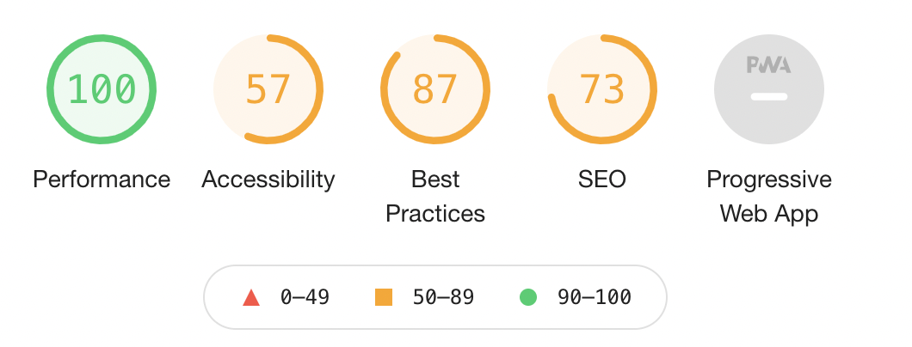

# Hacker News #

This app uses the Hacker News API to return a list of computer science articles. The original version is available at: <https://news.ycombinator.com/>. It is run by Y Combinator. This app features formatting for improved layout and readability.

This project was bootstrapped with [Create React App](https://github.com/facebook/create-react-app) using the basic template.

The original version of Hacker News at <https://news.ycombinator.com/> returned a Lighthouse accessibility score of 57 out of a possible 100.

